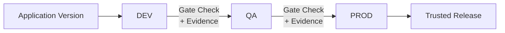

# AppTrust Patterns

## 1. Application Entity Creation (`app-trust-application-entity-creation`) [SIMPLE, ~3 min]

**Purpose:** Define application entities with clear business context and ownership.

**What You Do:**
1. Create applications within projects
2. Associate package versions with applications
3. Define ownership and business criticality

**JFrog Concepts:** Application Entity, Application Versions

**AppTrust REST APIs:** https://jfrog.com/help/r/jfrog-rest-apis/apptrust-rest-apis

API categories: Applications, Application Versions, Bound Packages, Lifecycle Policies, Stages & Lifecycles, Activity Log, Templates, Evaluations, Rules

**Implementation:**
```bash
# Create an application
curl -X POST -H "Authorization: Bearer $JFROG_ACCESS_TOKEN" \
  -H "Content-Type: application/json" \
  -d '{
    "name": "my-web-app",
    "description": "Customer-facing web application",
    "project_key": "myproject",
    "criticality": "high",
    "owner": "platform-team"
  }' \
  "$JFROG_URL/access/api/v1/applications"

# Bind packages to the application
curl -X POST -H "Authorization: Bearer $JFROG_ACCESS_TOKEN" \
  -H "Content-Type: application/json" \
  -d '{
    "application_name": "my-web-app",
    "packages": [
      {"name": "my-web-app", "version": "1.0.0", "repo": "docker-local", "type": "docker"}
    ]
  }' \
  "$JFROG_URL/access/api/v1/applications/my-web-app/versions"
```

---

## 2. Application Risk Governance (`app-trust-application-risk-management`) [SIMPLE, ~6 min]

**Purpose:** Define and govern your SDLC with evidence-based policy gates.

**Architecture:**



**How It Works:**
1. Define lifecycle stages (DEV → QA → PROD)
2. Define policy gates at each stage boundary (what evidence is required)
3. Application versions must satisfy all gate requirements to advance
4. Versions that pass all gates earn a "Trusted Release" badge

**JFrog Concepts:** Application Entity, Application Versions, Evidence-based Gates, Trusted Release

**Implementation:**
```bash
# Create lifecycle stages
curl -X POST -H "Authorization: Bearer $JFROG_ACCESS_TOKEN" \
  -H "Content-Type: application/json" \
  -d '{"name": "Development", "order": 1}' \
  "$JFROG_URL/access/api/v2/stages/"

curl -X POST -H "Authorization: Bearer $JFROG_ACCESS_TOKEN" \
  -H "Content-Type: application/json" \
  -d '{"name": "QA", "order": 2}' \
  "$JFROG_URL/access/api/v2/stages/"

curl -X POST -H "Authorization: Bearer $JFROG_ACCESS_TOKEN" \
  -H "Content-Type: application/json" \
  -d '{"name": "Production", "order": 3}' \
  "$JFROG_URL/access/api/v2/stages/"

# Create lifecycle policy with evidence-based gates
curl -X POST -H "Authorization: Bearer $JFROG_ACCESS_TOKEN" \
  -H "Content-Type: application/json" \
  -d '{
    "name": "standard-release-policy",
    "description": "Requires security scan and test evidence at each gate",
    "stages": ["Development", "QA", "Production"],
    "gates": [
      {
        "from_stage": "Development",
        "to_stage": "QA",
        "required_evidence": ["security-scan", "unit-tests"]
      },
      {
        "from_stage": "QA",
        "to_stage": "Production",
        "required_evidence": ["integration-tests", "performance-tests", "security-review"]
      }
    ]
  }' \
  "$JFROG_URL/access/api/v1/lifecycle-policies"

# Attach evidence at each stage (using jf evd create)
jf evd create \
  --package-name my-web-app --package-version 1.0.0 --package-repo-name docker-local \
  --key "$PRIVATE_KEY" \
  --predicate ./test-results.json \
  --predicate-type https://jfrog.com/evidence/test-result/v1
```

**Docs:** [AppTrust REST APIs](https://jfrog.com/help/r/jfrog-rest-apis/apptrust-rest-apis)
