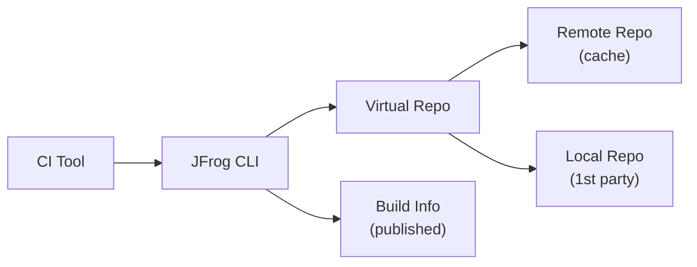

# CI Integration Patterns

## 1. CI Integration (`builds-ci-integration`) [SIMPLE]

**Purpose:** Integrate JFrog with any CI tool to cache dependencies, store build artifacts, and collect Build Info metadata.

**Architecture:**



**JFrog Concepts:** Virtual Repository, Remote Repository, Local Repository, Build Info

**Setup Creates:** Project + local repository + remote repository + virtual repository + CI tool configuration

**Implementation:**
```bash
# 1. Create repos (jfrog-artifactory skill)
jf rt repo-create local-repo-template.json   # local for your artifacts
jf rt repo-create remote-repo-template.json  # remote to cache public deps
jf rt repo-create virtual-repo-template.json # virtual to unify both

# 2. Configure CI build integration
jf npmc --repo-resolve=npm-virtual --repo-deploy=npm-local  # npm example
jf npm install --build-name=my-build --build-number=$BUILD_NUM
jf npm publish --build-name=my-build --build-number=$BUILD_NUM

# 3. Publish Build Info
jf rt build-collect-env my-build $BUILD_NUM
jf rt build-add-git my-build $BUILD_NUM
jf rt build-publish my-build $BUILD_NUM
```

**Docs:** [Build Integration](https://jfrog.com/help/r/jfrog-integrations-documentation/build-integration)

---

## 2. CI Integration with Security Scans & SBOM (`builds-ci-integration-with-security-scans`) [INTERMEDIATE]

**Purpose:** Same as above + continuous artifact scanning + automatic SBOM generation.

**Additional:** Xray scans complete packages/images upon upload; generates SBOM from Build Info.

**JFrog Concepts:** All above + Security Policies, Watches

**Setup Creates:** Project + repos + Xray policies + watches

**Implementation (additions to pattern 1):**
```bash
# 4. Create security policy (jfrog-security skill)
curl -X POST -H "Authorization: Bearer $JFROG_ACCESS_TOKEN" \
  -H "Content-Type: application/json" \
  -d '{"name":"ci-security","type":"security","rules":[{"name":"block-critical","criteria":{"min_severity":"Critical"},"actions":{"fail_build":true}}]}' \
  "$JFROG_URL/xray/api/v2/policies"

# 5. Create watch linking repos to policy
curl -X POST -H "Authorization: Bearer $JFROG_ACCESS_TOKEN" \
  -H "Content-Type: application/json" \
  -d '{"general_data":{"name":"ci-watch","active":true},"project_resources":{"resources":[{"type":"repository","name":"npm-local"}]},"assigned_policies":[{"name":"ci-security","type":"security"}]}' \
  "$JFROG_URL/xray/api/v2/watches"

# 6. Scan build (automatically or on-demand)
jf rt build-scan my-build $BUILD_NUM --fail=true
```

---

## 3. CI Integration with Curation + Security Scans (`builds-ci-integration-with-package-curation-and-security-scans`) [ADVANCED]

**Purpose:** Same as above + block risky 3rd-party packages before they enter the organization.

**Additional:** JFrog Curation validates dependencies against org security criteria before caching.

**JFrog Concepts:** All above + Curation

**Requires:** Curation activation on your JFrog instance.

**Implementation (additions to pattern 2):**
```bash
# 7. Enable curation on remote repos (jfrog-curation skill)
curl -X PUT -H "Authorization: Bearer $JFROG_ACCESS_TOKEN" \
  -H "Content-Type: application/json" \
  -d '{"repo_key":"npm-remote","enabled":true}' \
  "$JFROG_URL/curation/api/v1/curated_repos/npm-remote"

# 8. Create curation policy
curl -X POST -H "Authorization: Bearer $JFROG_ACCESS_TOKEN" \
  -H "Content-Type: application/json" \
  -d '{"name":"block-malicious","enabled":true,"conditions":[{"type":"malicious_package"},{"type":"cvss_score","min_severity":9.0}],"repositories":["npm-remote"],"action":"block"}' \
  "$JFROG_URL/curation/api/v1/policies"

# 9. Audit project against curation policies
jf curation-audit
```

---

## 4. CI Integration with Evidence Collection (`builds-ci-integration-with-evidence-collection`) [ADVANCED]

**Purpose:** Same as CI Integration + gather and attach signed evidence to document the SDLC process.

**Additional:** JFrog CLI collects evidence during builds; used for auditing and compliance.

**JFrog Concepts:** All above + Evidence

**Implementation (additions to pattern 1):**
```bash
# 10. Prepare predicate JSON
echo '{"actor":"ci-bot","date":"'$(date -u +"%Y-%m-%dT%H:%M:%SZ")'","result":"pass"}' > predicate.json

# 11. Attach evidence to package (jfrog-cli / jfrog-distribution skill)
jf evd create \
  --package-name my-app --package-version $VERSION --package-repo-name npm-local \
  --key "$PRIVATE_KEY" \
  --predicate ./predicate.json \
  --predicate-type https://jfrog.com/evidence/signature/v1

# 12. Attach evidence to build
jf evd create \
  --build-name my-build --build-number $BUILD_NUM \
  --key "$PRIVATE_KEY" \
  --predicate ./predicate.json \
  --predicate-type https://jfrog.com/evidence/build-signature/v1
```

**Docs:** [Evidence Management](https://jfrog.com/help/r/jfrog-artifactory-documentation/evidence-management), [Evidence Examples](https://github.com/jfrog/Evidence-Examples)
