# Flow Suggestions

Use this file in two situations:
1. **After an action** -- identify whether the completed action is part of a larger pattern and suggest the next step.
2. **During exploration** -- when the user doesn't know what to do, asks "what can I do?", or wants to get started with their JFrog environment.

Always render a mermaid progress diagram and use `AskQuestion` to let the user pick how to proceed.

## Pre-flight Gate

Before showing suggestions, run the pre-flight check ([../jfrog-cli/preflight.md](../jfrog-cli/preflight.md)) if it has not been run this session. Use the results to filter out paths for unavailable services:

- Only offer **Security / Xray** options if Xray is available.
- Only offer **Curation** options if Curation is available.
- Only offer **AppTrust** options if AppTrust is available.
- Only offer **Release Lifecycle / Distribution** options if Lifecycle is available.

In diagrams, apply `:::unavailable` to nodes for services that are not deployed. In `AskQuestion`, omit options for unavailable services entirely.

## Diagram conventions

- Nodes with `:::done` represent completed steps (green border).
- Nodes with `:::next` represent the suggested next step (amber dashed border).
- Nodes with `:::unavailable` represent services not deployed on this instance (grey dashed border). Omit these from `AskQuestion` options.
- Unstyled nodes represent future steps.
- **Always prefer `flowchart LR`** (horizontal) -- this is the default. Avoid fan-out patterns (one node with many outgoing edges) as they stack vertically and create tall graphs. Instead, chain nodes horizontally (`A --> B --> C --> D`). Only use `flowchart TD` when the architecture genuinely requires top-down layout (e.g., load balancer above two JPDs).
- Always include the classDef lines at the end of each diagram.
- **The diagram is mandatory** -- always render it so the user sees their progress visually.
- After the diagram, use the `AskQuestion` tool to offer a selection (see "Suggested options" sections below).

---

## Getting Started (Discovery)

When the user doesn't know what to do, asks what they can do with JFrog, or wants help getting started -- show the entry-point diagram and let them pick a path.

### Entry-point diagram

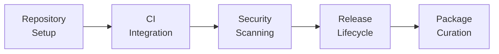

Apply `:::unavailable` to nodes whose service is not deployed (e.g., Security if Xray is down, Curation if Curation is not available). Omit unavailable options from the `AskQuestion` below.

### Suggested options (Getting Started)

Show the entry-point diagram, then ask via `AskQuestion`. Only include options for services that are available (per the pre-flight check):

| Option | Label | Requires |
|--------|-------|----------|
| repo-setup | Set up repositories -- local, remote, and virtual repos for your packages | Artifactory (always) |
| ci-integration | Integrate JFrog with your CI pipeline to collect Build Info | Artifactory (always) |
| security | Set up security scanning with Xray policies and watches | Xray |
| release-lifecycle | Manage releases -- create Release Bundles and promote through environments | Lifecycle |
| curation | Set up package curation to block risky open-source packages | Curation |
| something-else | Something else | -- |

If the user provides context about their goal (e.g., "I want to secure my supply chain"), narrow the options to the most relevant journey. See the [journeys.md](journeys.md) file and the **Cross-Cutting Journey Progress** section below for journey-specific flows.

---

## Artifactory Actions

| You just... | Part of pattern | Next step |
|---|---|---|
| Created a local repository | Basic Repository Setup [SIMPLE] | Create a remote repo to cache public packages |
| Created a remote repository | Basic Repository Setup [SIMPLE] | Create a virtual repo that unifies local + remote |
| Created a virtual repository | Basic Repository Setup [SIMPLE] | Configure CI to resolve and deploy through the virtual repo |
| Set up basic repos | CI Integration [SIMPLE] | Configure JFrog CLI build integration to collect Build Info |
| Published Build Info | CI Integration with Security Scans [INTERMEDIATE] | Add an Xray security policy and watch for your build |
| Configured replication | Multi-Site Active/Standby [ADVANCED] | Set up Access Federation for user and permission sync |
| Created per-team local repos | Cross-Team Collaboration [ADVANCED] | Create a shared virtual repo and configure per-team permissions |

### Progress: Basic Repository Setup

After creating a local repo:

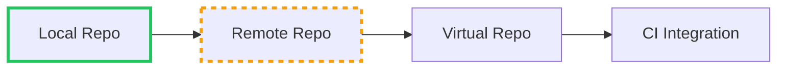

After creating a remote repo:

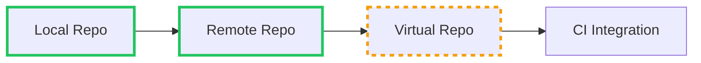

After creating a virtual repo:

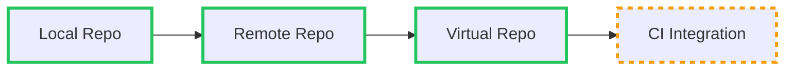

### Suggested options (Artifactory)

After creating a local repo -- show the "after local repo" diagram, then ask via `AskQuestion`:

| Option | Label |
|--------|-------|
| remote-repo | Create a remote repo to cache public packages (next step) |
| ci-integration | Jump ahead to CI integration with this repo |
| something-else | Something else |

After creating a remote repo -- show the "after remote repo" diagram, then ask via `AskQuestion`:

| Option | Label |
|--------|-------|
| virtual-repo | Create a virtual repo -- single URL for both (next step) |
| security-scanning | Set up security scanning for these repos |
| something-else | Something else |

After creating a virtual repo -- show the "after virtual repo" diagram, then ask via `AskQuestion`:

| Option | Label |
|--------|-------|
| ci-integration | Set up CI integration to build and deploy through this repo (next step) |
| security-policies | Add security policies and watches for this repo |
| something-else | Something else |

---

## Security Actions

> **Requires:** Xray (`JFROG_HAS_XRAY=true`). Skip this section if Xray is not available on the instance.

| You just... | Part of pattern | Next step |
|---|---|---|
| Created a security policy | Xray Security [INTERMEDIATE] | Create a watch that links repos to the policy |
| Created a watch | Xray Security [INTERMEDIATE] | Trigger a scan or review existing violations |
| Scanned a build | Xray Security [INTERMEDIATE] | Review violations and set up ignore rules if needed |
| Reviewed violations | Xray Security [INTERMEDIATE] | Generate a vulnerability report or SBOM |
| Ran `jf audit` in CI | JFrog Advanced Security [ADVANCED] | Enable SAST, secrets detection, and contextual analysis |

### Progress: Xray Security Setup

After creating a policy:

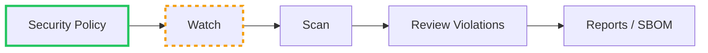

After creating a watch:

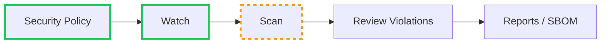

After scanning:

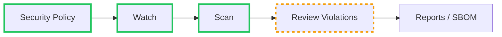

### Suggested options (Security)

After creating a policy -- show the "after policy" diagram, then ask via `AskQuestion`:

| Option | Label |
|--------|-------|
| create-watch | Create a watch to connect your repos to this policy (next step) |
| setup-curation | Set up curation to block risky packages at the gate |
| something-else | Something else |

After creating a watch -- show the "after watch" diagram, then ask via `AskQuestion`:

| Option | Label |
|--------|-------|
| trigger-scan | Trigger a scan on an existing build (next step) |
| review-violations | Review any current violations across watched repos |
| something-else | Something else |

After scanning -- show the "after scan" diagram, then ask via `AskQuestion`:

| Option | Label |
|--------|-------|
| review-violations | Review violations and set up ignore rules (next step) |
| generate-report | Generate a vulnerability report or SBOM |
| something-else | Something else |

---

## Release Lifecycle Actions

> **Requires:** Lifecycle service (`JFROG_HAS_LIFECYCLE=true`). Skip this section if Lifecycle is not available on the instance.

| You just... | Part of pattern | Next step |
|---|---|---|
| Published Build Info | RLM without Security Gates [SIMPLE] | Create a Release Bundle from the build |
| Created a Release Bundle | RLM without Security Gates [SIMPLE] | Promote through environments (DEV, STAGING, PROD) |
| Promoted to PROD | RLM with Distribution [ADVANCED] | Distribute to Edge nodes |
| Created a Release Bundle | RLM with Security Gates [INTERMEDIATE] | Set up an Xray policy to gate promotions |
| Promoted a release | RLM with Evidence [ADVANCED] | Attach signed evidence to the release bundle |

### Progress: Release Lifecycle (full flow)

After publishing Build Info:

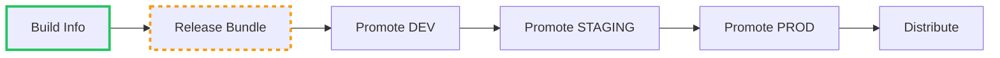

After creating a Release Bundle:

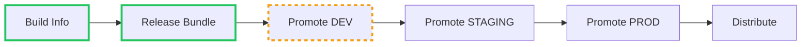

After promoting to PROD:

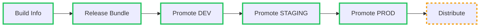

### Progress: Release Lifecycle with Security Gates

After creating a Release Bundle (no gates yet):

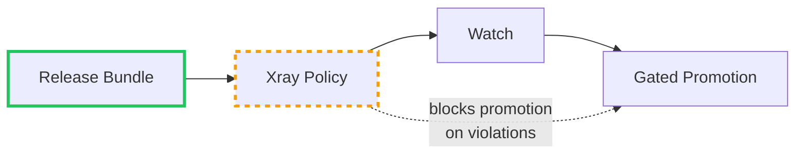

### Suggested options (Release Lifecycle)

After publishing Build Info -- show the "after Build Info" diagram, then ask via `AskQuestion`:

| Option | Label |
|--------|-------|
| create-bundle | Create a Release Bundle from this build (next step) |
| add-scanning | Add security scanning to the build first |
| something-else | Something else |

After creating a Release Bundle -- show the "after Release Bundle" diagram, then ask via `AskQuestion`:

| Option | Label |
|--------|-------|
| promote-dev | Promote through environments -- starting with DEV (next step) |
| add-gates | Add security gates before promotion |
| something-else | Something else |

After promoting to PROD -- show the "after PROD" diagram, then ask via `AskQuestion`:

| Option | Label |
|--------|-------|
| distribute | Distribute this release to Edge nodes (next step) |
| attach-evidence | Attach signed evidence for compliance |
| something-else | Something else |

---

## Curation Actions

> **Requires:** Curation service (`JFROG_HAS_CURATION=true`). Skip this section if Curation is not available on the instance.

| You just... | Part of pattern | Next step |
|---|---|---|
| Enabled curation on a remote repo | Curation & Governance [ADVANCED] | Create a curation policy to define blocking rules |
| Created a curation policy | Curation & Governance [ADVANCED] | Run `jf curation-audit` in your project to test it |
| Ran `jf curation-audit` | CI Integration with Curation [ADVANCED] | Integrate the audit into your CI pipeline |

### Progress: Curation Setup

After enabling curation on a remote repo:

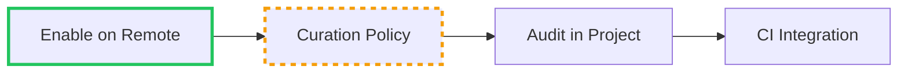

After creating a policy:

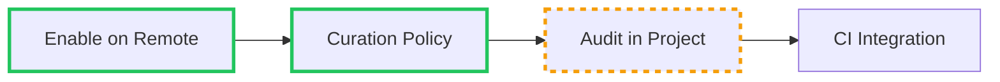

### Suggested options (Curation)

After enabling curation -- show the "after enabling" diagram, then ask via `AskQuestion`:

| Option | Label |
|--------|-------|
| create-policy | Create a curation policy to define blocking rules (next step) |
| review-audit-log | Review the curation audit log to see what's already been blocked |
| something-else | Something else |

After creating a policy -- show the "after policy" diagram, then ask via `AskQuestion`:

| Option | Label |
|--------|-------|
| run-audit | Run `jf curation-audit` in your project to test it (next step) |
| ci-integration | Integrate the audit into your CI pipeline |
| something-else | Something else |

---

## Distribution Actions

> **Requires:** Lifecycle service (`JFROG_HAS_LIFECYCLE=true`). Skip this section if Lifecycle/Distribution is not available on the instance.

| You just... | Part of pattern | Next step |
|---|---|---|
| Created a Release Bundle | RLM with Distribution [ADVANCED] | Promote through environments before distributing |
| Promoted to final environment | RLM with Distribution [ADVANCED] | Distribute to Edge nodes |
| Distributed to Edge nodes | RLM with Evidence [ADVANCED] | Attach signed evidence for compliance |

### Progress: Distribution flow

After promoting to PROD:

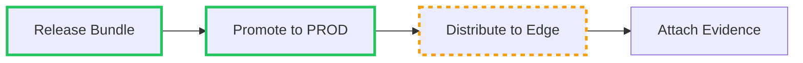

### Suggested options (Distribution)

After promoting to PROD -- show the "after PROD" diagram, then ask via `AskQuestion`:

| Option | Label |
|--------|-------|
| distribute | Distribute this release to Edge nodes (next step) |
| attach-evidence | Attach signed evidence before distributing |
| something-else | Something else |

After distributing -- ask via `AskQuestion`:

| Option | Label |
|--------|-------|
| attach-evidence | Attach signed evidence for compliance (next step) |
| check-status | Check distribution status on Edge nodes |
| something-else | Something else |

---

## AppTrust Actions

> **Requires:** AppTrust service (`JFROG_HAS_APPTRUST=true`). Skip this section if AppTrust is not available on the instance.

| You just... | Part of pattern | Next step |
|---|---|---|
| Created an application entity | Application Entity Creation [SIMPLE] | Bind package versions to the application |
| Bound packages to an application | Application Risk Governance [SIMPLE] | Define lifecycle stages and policy gates |
| Created lifecycle stages | Application Risk Governance [SIMPLE] | Create a lifecycle policy with evidence-based gates |

### Progress: AppTrust Setup

After creating an application:

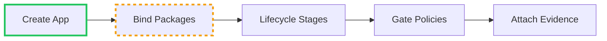

After binding packages:

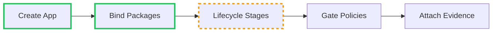

### Suggested options (AppTrust)

After creating an application -- show the "after creating application" diagram, then ask via `AskQuestion`:

| Option | Label |
|--------|-------|
| bind-packages | Bind package versions to this application (next step) |
| security-scanning | Set up security scanning for the application's packages |
| something-else | Something else |

After binding packages -- show the "after binding packages" diagram, then ask via `AskQuestion`:

| Option | Label |
|--------|-------|
| lifecycle-stages | Define lifecycle stages and create policy gates (next step) |
| review-risk | Review the application's current risk posture |
| something-else | Something else |

---

## Cross-Cutting Journey Progress

When a user has completed actions across multiple categories, show the journey-level progress.

### Journey: Modernize Delivery

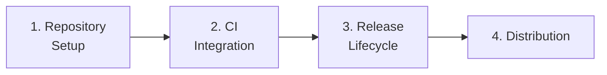

Mark steps as `:::done` or `:::next` based on what the user has completed.

### Journey: Secure SDLC

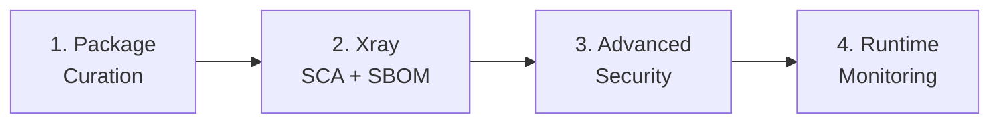

### Journey: Accelerate Productivity

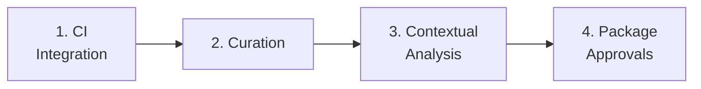

### Suggested options (Journeys)

After completing a journey step -- show the journey diagram with completed steps marked, then ask via `AskQuestion` with options built from the journey context:

| Option | Label |
|--------|-------|
| next-step | [Next step in the journey] (next step) |
| alt-path | [Alternative step or related pattern] |
| something-else | Something else |

Example after completing repository setup in Modernize Delivery:

| Option | Label |
|--------|-------|
| ci-integration | Set up CI integration to automate builds (next step in Modernize Delivery) |
| security-scanning | Add security scanning to the repos you just created |
| something-else | Something else |

Example after completing Xray setup in Secure SDLC:

| Option | Label |
|--------|-------|
| advanced-security | Enable Advanced Security -- contextual analysis, SAST, secrets detection (next step) |
| setup-curation | Set up curation to block risky packages at the gate |
| something-else | Something else |
