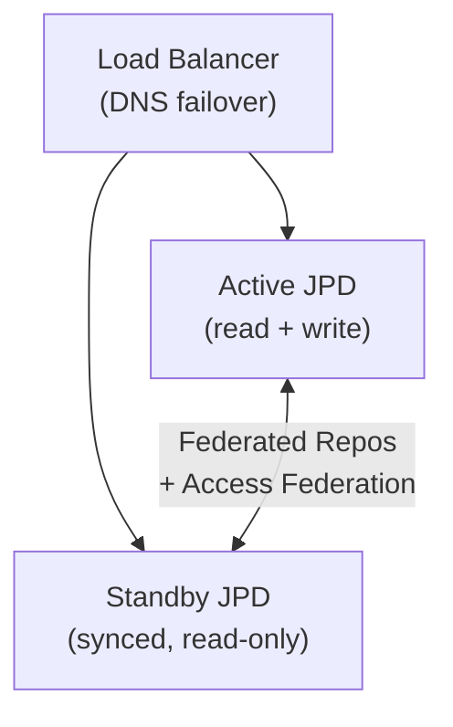
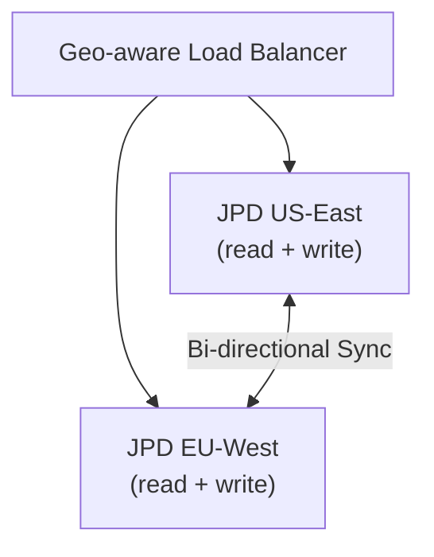
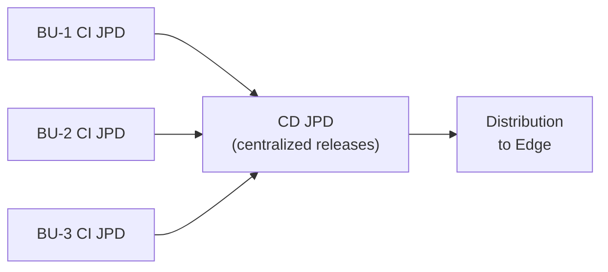
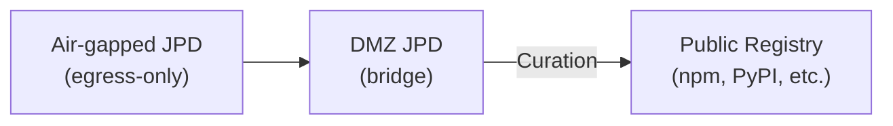
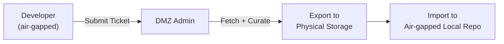

# Multi-Site Architecture Patterns

All multi-site patterns are **ADVANCED** and require multiple JFrog Platform Deployments (JPDs).

## 1. Active/Standby with DNS Failover (`multi-site-active-standby-with-dns-failover`)

**Purpose:** High availability with seamless failover using synced sites via load balancer.

**Architecture:**



- Active and Standby JPDs sync repo data + access settings via Federated Repos and Access Federation
- Load balancer redirects traffic on failure
- Admins can switch active site via UI

**JFrog Concepts:** Federated Repositories, Access Federation

**Implementation:**
```bash
# On Active JPD: Create federated repo (replace <STANDBY_JPD_URL> with the other JPD base URL)
curl -X PUT -H "Authorization: Bearer $JFROG_ACCESS_TOKEN" \
  -H "Content-Type: application/json" \
  -d '{"key":"shared-docker","rclass":"federated","packageType":"docker","members":[{"url":"https://<STANDBY_JPD_URL>/artifactory/shared-docker","enabled":true}]}' \
  "$JFROG_URL/artifactory/api/repositories/shared-docker"

# Set up Access Federation (circle of trust)
curl -X POST -H "Authorization: Bearer $JFROG_ACCESS_TOKEN" \
  -H "Content-Type: application/json" \
  -d '{"url":"https://<STANDBY_JPD_URL>","name":"standby-jpd"}' \
  "$JFROG_URL/access/api/v1/federation/circle_of_trust"
```

---

## 2. Active/Active with Geo DNS (`multi-site-active-active-with-geo-dns`)

**Purpose:** Seamless global collaboration using synced sites with geographic routing.

**Architecture:**



- Both sites are active, handling reads and writes
- Load balancer routes to geographically closest site
- Bi-directional federated repo sync ensures real-time collaboration

**Implementation:** Same as Active/Standby but with bi-directional federation on both JPDs. Both members are set as `enabled: true` with full read/write.

---

## 3. CI and CD Separation (`multi-site-with-ci-cd-separation`)

**Purpose:** Multiple independent CI sites connected to a centralized CD hub.

**Architecture:**



- Business units have independent CI JPDs for development
- Production-ready releases sync to CD site via federated repos
- Ops manage releases centrally from the CD JPD

---

## 4. Partially Air-Gapped Package Curation (`multi-site-partially-air-gapped-package-curation`)

**Purpose:** OSS dependency control with one-way connectivity (egress only).

**Architecture:**



- Air-gapped JPD has remote repos pointing to DMZ JPD
- DMZ JPD's remote repos go through Curation before fetching from public registries
- Packages cached at both levels
- Developer tracked as requester in audit

**Implementation:**
```bash
# On DMZ JPD: Create curated remote repo
curl -X PUT -H "Authorization: Bearer $JFROG_ACCESS_TOKEN_DMZ" \
  -H "Content-Type: application/json" \
  -d '{"key":"npm-curated","rclass":"remote","packageType":"npm","url":"https://registry.npmjs.org"}' \
  "$DMZ_URL/artifactory/api/repositories/npm-curated"

# Enable curation on DMZ remote
curl -X PUT -H "Authorization: Bearer $JFROG_ACCESS_TOKEN_DMZ" \
  -H "Content-Type: application/json" \
  -d '{"repo_key":"npm-curated","enabled":true}' \
  "$DMZ_URL/curation/api/v1/curated_repos/npm-curated"

# On Air-gapped JPD: Remote repo pointing to DMZ
curl -X PUT -H "Authorization: Bearer $JFROG_ACCESS_TOKEN_AG" \
  -H "Content-Type: application/json" \
  -d '{"key":"npm-remote","rclass":"remote","packageType":"npm","url":"https://<DMZ_JPD_URL>/artifactory/npm-curated"}' \
  "$AIRGAP_URL/artifactory/api/repositories/npm-remote"
```

---

## 5. Fully Air-Gapped Package Curation (`multi-site-fully-air-gapped-package-curation`)

**Purpose:** OSS dependency control with zero network connectivity.

**Architecture:**



**Workflow:**
1. Developer submits ticket for needed packages
2. DMZ admin triggers fetch through Curation
3. Curation validates against policies
4. Approved packages exported to physical media or secure transfer
5. Packages imported into air-gapped JPD's local repository

**Implementation:**
```bash
# On DMZ: Fetch and validate packages (automated or manual)
# Export approved packages
curl -H "Authorization: Bearer $JFROG_ACCESS_TOKEN_DMZ" \
  -O "$DMZ_URL/artifactory/npm-curated/lodash/-/lodash-4.17.21.tgz"

# Physical transfer to air-gapped network...

# On Air-gapped JPD: Import to local repo
curl -X PUT -H "Authorization: Bearer $JFROG_ACCESS_TOKEN_AG" \
  -T lodash-4.17.21.tgz \
  "$AIRGAP_URL/artifactory/npm-local/lodash/-/lodash-4.17.21.tgz"
```
