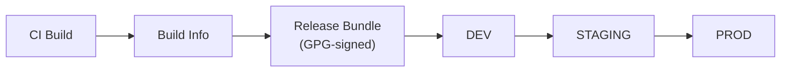
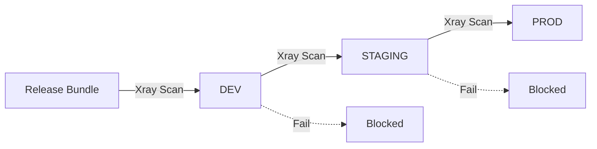
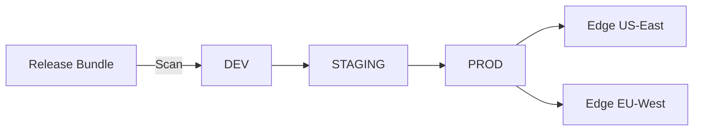
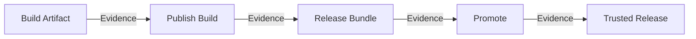

# Release Lifecycle Patterns

## 1. Release Lifecycle Management (without Security Gates) (`release-lifecycle-management-without-security-gates`) [SIMPLE]

**Purpose:** Turn CI outputs into immutable releases and advance them through SDLC stages.

**Architecture:**



**JFrog Concepts:** Release Bundle (immutable, GPG-signed), Environments (DEV/STAGE/PROD), Build Info

**Implementation:**
```bash
# 1. Publish build info (from CI)
jf rt build-publish my-app $BUILD_NUM

# 2. Create immutable Release Bundle from build
jf release-bundle-create my-app-release 1.0.0 \
  --builds="my-app/$BUILD_NUM" \
  --signing-key=my-gpg-key --sync=true

# 3. Promote through environments
jf release-bundle-promote my-app-release 1.0.0 --environment=DEV
jf release-bundle-promote my-app-release 1.0.0 --environment=STAGING
jf release-bundle-promote my-app-release 1.0.0 --environment=PROD
```

**Docs:** [Release Lifecycle Management](https://jfrog.com/help/r/jfrog-artifactory-documentation/release-lifecycle-management)

---

## 2. Release Lifecycle with Security Gates (`release-lifecycle-with-security-gates`) [INTERMEDIATE]

**Purpose:** Same as above + security scanning before promotion between stages. Violations block promotion.

**Architecture:**



**Implementation (additions to pattern 1):**
```bash
# Create Xray policy that blocks release bundle promotion
curl -X POST -H "Authorization: Bearer $JFROG_ACCESS_TOKEN" \
  -H "Content-Type: application/json" \
  -d '{"name":"release-gate","type":"security","rules":[{"name":"block-high","criteria":{"min_severity":"High"},"actions":{"block_release_bundle_distribution":true,"fail_build":true}}]}' \
  "$JFROG_URL/xray/api/v2/policies"

# Create watch on release bundles
curl -X POST -H "Authorization: Bearer $JFROG_ACCESS_TOKEN" \
  -H "Content-Type: application/json" \
  -d '{"general_data":{"name":"release-watch","active":true},"project_resources":{"resources":[{"type":"all-release-bundles"}]},"assigned_policies":[{"name":"release-gate","type":"security"}]}' \
  "$JFROG_URL/xray/api/v2/watches"

# Promotion will be blocked if violations are found
jf release-bundle-promote my-app-release 1.0.0 --environment=PROD
```

---

## 3. Release Lifecycle with Security Gates & Distribution (`release-lifecycle-management-with-build-integration-security-gates-and-distribution`) [ADVANCED]

**Purpose:** Same as above + Distribution delivers immutable Release Bundles to Edge nodes.

**Requires:** Distribution activation on your JFrog instance.

**Architecture:**



**Implementation (additions to pattern 2):**
```bash
# Distribute to edge nodes
jf release-bundle-distribute my-app-release 1.0.0 \
  --site="edge-*" --sync=true

# Or via REST API
curl -X POST -H "Authorization: Bearer $JFROG_ACCESS_TOKEN" \
  -H "Content-Type: application/json" \
  -d '{"auto_create_missing_repositories":true,"distribution_rules":[{"site_name":"edge-us-east"},{"site_name":"edge-eu-west"}]}' \
  "$JFROG_URL/distribution/api/v1/distribution/my-app-release/1.0.0"
```

---

## 4. Release Lifecycle with Evidence (`release-lifecycle-with-evidence`) [ADVANCED]

**Purpose:** Same as above + signed attestation evidence attached at every stage for compliance.

**Evidence Chain:**



**Implementation (additions to pattern 1):**
```bash
echo '{"actor":"ci-bot","date":"'$(date -u +"%Y-%m-%dT%H:%M:%SZ")'"}' > predicate.json

# Evidence on package
jf evd create --package-name my-app --package-version 1.0 --package-repo-name docker-local \
  --key "$PRIVATE_KEY" --predicate ./predicate.json \
  --predicate-type https://jfrog.com/evidence/signature/v1

# Evidence on build
jf evd create --build-name my-app --build-number $BUILD_NUM \
  --key "$PRIVATE_KEY" --predicate ./predicate.json \
  --predicate-type https://jfrog.com/evidence/build-signature/v1

# Evidence on release bundle
jf evd create --release-bundle my-app-release --release-bundle-version 1.0.0 \
  --key "$PRIVATE_KEY" --predicate ./predicate.json \
  --predicate-type https://jfrog.com/evidence/rbv2-signature/v1
```

**Docs:** [Evidence Management](https://jfrog.com/help/r/jfrog-artifactory-documentation/evidence-management), [Evidence Examples](https://github.com/jfrog/Evidence-Examples)
