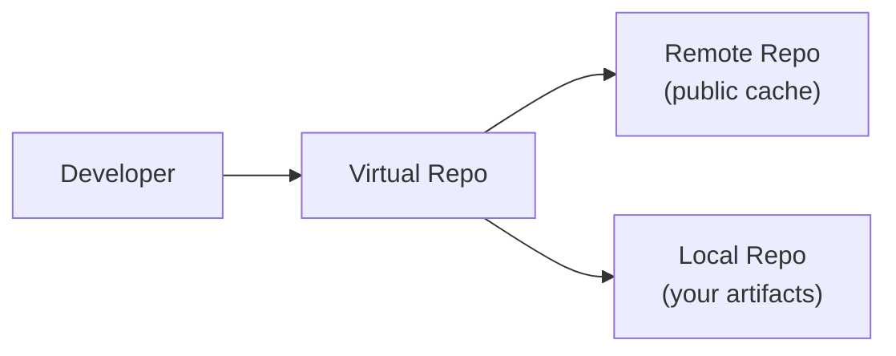
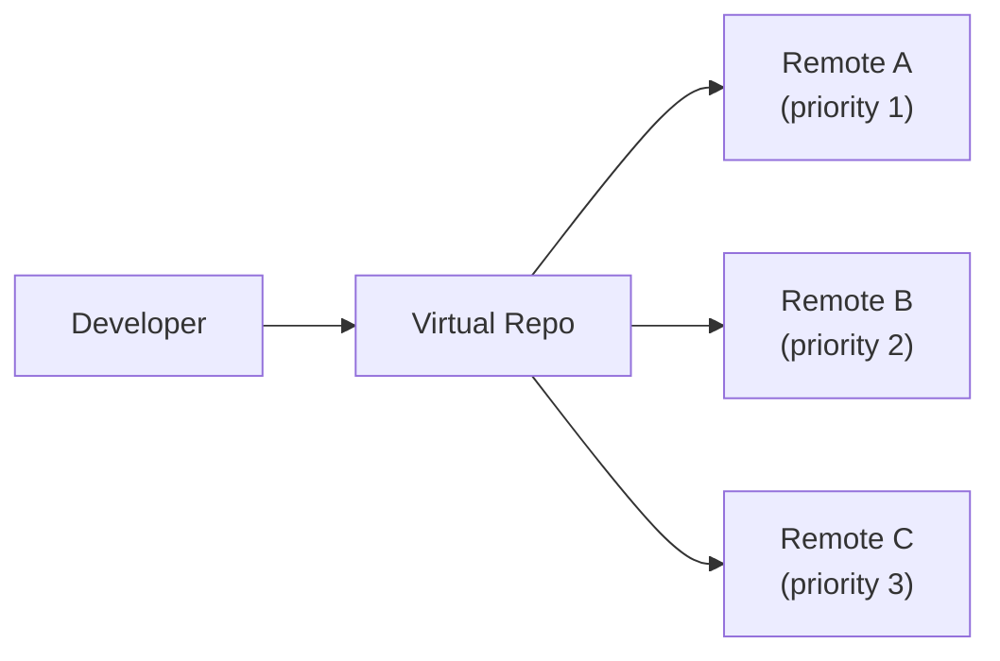
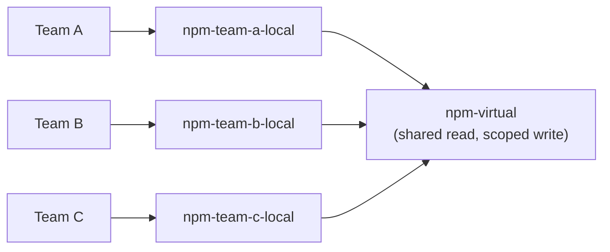

# Repository Setup Patterns

## 1. Basic Repository Setup (`repositories-basic-repository-setup`) [SIMPLE]

**Purpose:** Single endpoint to resolve 3rd-party dependencies and deploy 1st-party packages.

**Architecture:**



Dependencies are cached on first fetch for faster future resolution.

**Setup Creates:** Project + local + remote + virtual repositories for chosen package type.

**Implementation:**
```bash
# Create local repo for your artifacts
curl -X PUT -H "Authorization: Bearer $JFROG_ACCESS_TOKEN" \
  -H "Content-Type: application/json" \
  -d '{"key":"npm-local","rclass":"local","packageType":"npm"}' \
  "$JFROG_URL/artifactory/api/repositories/npm-local"

# Create remote repo to cache public packages
curl -X PUT -H "Authorization: Bearer $JFROG_ACCESS_TOKEN" \
  -H "Content-Type: application/json" \
  -d '{"key":"npm-remote","rclass":"remote","packageType":"npm","url":"https://registry.npmjs.org"}' \
  "$JFROG_URL/artifactory/api/repositories/npm-remote"

# Create virtual repo combining both
curl -X PUT -H "Authorization: Bearer $JFROG_ACCESS_TOKEN" \
  -H "Content-Type: application/json" \
  -d '{"key":"npm","rclass":"virtual","packageType":"npm","repositories":["npm-local","npm-remote"],"defaultDeploymentRepo":"npm-local"}' \
  "$JFROG_URL/artifactory/api/repositories/npm"
```

**Docs:** [Repository Management](https://jfrog.com/help/r/jfrog-artifactory-documentation/repository-management)

---

## 2. Dependency Resolution from Multiple Upstream Sources (`repositories-dependency-resolution-from-multiple-upstream-sources`) [INTERMEDIATE]

**Purpose:** Pull dependencies from multiple sources with prioritization through a single access point.

**Architecture:**



Virtual repo tries remotes in priority order until the dependency is found, then caches for future.

**Implementation:**
```bash
# Create multiple remote repos
curl -X PUT -H "Authorization: Bearer $JFROG_ACCESS_TOKEN" \
  -H "Content-Type: application/json" \
  -d '{"key":"npm-remote-internal","rclass":"remote","packageType":"npm","url":"https://internal-registry.company.com"}' \
  "$JFROG_URL/artifactory/api/repositories/npm-remote-internal"

curl -X PUT -H "Authorization: Bearer $JFROG_ACCESS_TOKEN" \
  -H "Content-Type: application/json" \
  -d '{"key":"npm-remote-public","rclass":"remote","packageType":"npm","url":"https://registry.npmjs.org"}' \
  "$JFROG_URL/artifactory/api/repositories/npm-remote-public"

# Virtual with priority order (array order = priority)
curl -X PUT -H "Authorization: Bearer $JFROG_ACCESS_TOKEN" \
  -H "Content-Type: application/json" \
  -d '{"key":"npm","rclass":"virtual","packageType":"npm","repositories":["npm-local","npm-remote-internal","npm-remote-public"],"defaultDeploymentRepo":"npm-local"}' \
  "$JFROG_URL/artifactory/api/repositories/npm"
```

---

## 3. Setup for Cross-Team Collaboration (`repositories-setup-for-cross-team-collaboration`) [ADVANCED]

**Purpose:** Share certain resources between teams while keeping others dedicated per team.

**Architecture:**



All teams use the same virtual repo URL. Permissions control who deploys where. Each team has its own local repo but can read from all.

**Implementation:**
```bash
# Create per-team local repos
for team in team-a team-b team-c; do
  curl -X PUT -H "Authorization: Bearer $JFROG_ACCESS_TOKEN" \
    -H "Content-Type: application/json" \
    -d "{\"key\":\"npm-${team}-local\",\"rclass\":\"local\",\"packageType\":\"npm\"}" \
    "$JFROG_URL/artifactory/api/repositories/npm-${team}-local"
done

# Virtual combining all
curl -X PUT -H "Authorization: Bearer $JFROG_ACCESS_TOKEN" \
  -H "Content-Type: application/json" \
  -d '{"key":"npm","rclass":"virtual","packageType":"npm","repositories":["npm-team-a-local","npm-team-b-local","npm-team-c-local","npm-remote"]}' \
  "$JFROG_URL/artifactory/api/repositories/npm"

# Permissions per team (jfrog-access skill)
curl -X POST -H "Authorization: Bearer $JFROG_ACCESS_TOKEN" \
  -H "Content-Type: application/json" \
  -d '{"name":"team-a-deploy","resources":{"repository":{"targets":[{"name":"npm-team-a-local"}],"actions":["read","write","annotate"]}},"principals":{"groups":[{"name":"team-a","permissions":["read","write","annotate"]}]}}' \
  "$JFROG_URL/access/api/v2/permissions"
```
