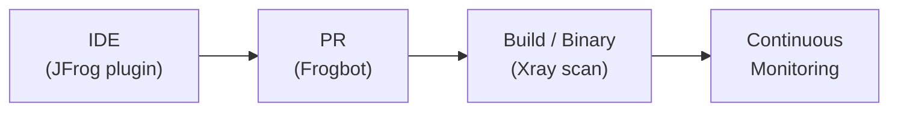
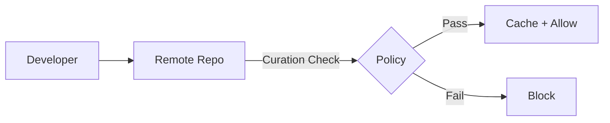

# Supply Chain Security Patterns

## 1. Secure Your Supply Chain with Xray (`xray-security`) [INTERMEDIATE]

**Purpose:** Detect, prioritize, and remediate open source risks across the entire SDLC.

**Architecture:**



**SDLC Stages Covered:**
1. **IDE** -- real-time scanning via JFrog plugin
2. **PR** -- Frogbot scans pull requests before merge
3. **Build/Binary** -- Xray scans after build publish
4. **Continuous Monitoring** -- ongoing scanning for new CVEs on indexed repos

**Risk Types:** Malicious Package, Software Vulnerability, License Risk, Operational Risk

**Implementation:**
```bash
# Create security policy
curl -X POST -H "Authorization: Bearer $JFROG_ACCESS_TOKEN" \
  -H "Content-Type: application/json" \
  -d '{"name":"sdlc-security","type":"security","rules":[{"name":"block-high","criteria":{"min_severity":"High"},"actions":{"fail_build":true,"block_download":{"active":true}}}]}' \
  "$JFROG_URL/xray/api/v2/policies"

# Create watch on production repos
curl -X POST -H "Authorization: Bearer $JFROG_ACCESS_TOKEN" \
  -H "Content-Type: application/json" \
  -d '{"general_data":{"name":"sdlc-watch","active":true},"project_resources":{"resources":[{"type":"all-repos"}]},"assigned_policies":[{"name":"sdlc-security","type":"security"}]}' \
  "$JFROG_URL/xray/api/v2/watches"

# CLI scanning in CI
jf audit --fail=true --min-severity=High
```

**Docs:** [Xray](https://jfrog.com/help/r/jfrog-security-user-guide/products/xray)

---

## 2. JFrog Advanced Security (`jas-security`) [ADVANCED]

**Purpose:** Prioritize security risks and identify hidden exposure. Reduces noise by up to 80%.

**Capabilities:**
- **Contextual Analysis** -- determines if CVEs are actually reachable/exploitable
- **Secrets Detection** -- finds leaked credentials in code and binaries
- **SAST** -- static analysis of source code
- **IaC Scanning** -- checks Terraform, CloudFormation, K8s YAML for misconfigurations
- **App Config Exposures** -- detects insecure application settings

**Implementation:**
```bash
# JAS features are enabled at system level and apply to all Xray scans
# Use CLI with JAS flags for scanning
jf audit --sast --secrets --iac

# Results include applicability field for each CVE:
# "applicable", "not_applicable", or "undetermined"
```

**Docs:** [Advanced Security](https://jfrog.com/help/r/jfrog-security-user-guide/products/advanced-security)

---

## 3. Runtime Security Monitoring (`run-time-security`) [ADVANCED]

**Purpose:** Monitor Kubernetes deployments for real-time security threats.

**Capabilities:**
- Real-time alerts for unauthorized images
- Impact assessment when new CVEs are announced
- Image lineage tracing back to build owner

**JFrog Concepts:** Image Integrity, Runtime Sensor, Runtime Controller, Package Lineage

**Requires:** Runtime activation on your JFrog instance.

**Implementation:**
```bash
# Get registration token (jfrog-security skill)
curl -H "Authorization: Bearer $JFROG_ACCESS_TOKEN" \
  "$JFROG_URL/runtime/api/v1/registration-token"

# Deploy Runtime Sensor in K8s cluster (uses the token)
# List monitored clusters
curl -X POST -H "Authorization: Bearer $JFROG_ACCESS_TOKEN" \
  -H "Content-Type: application/json" \
  -d '{"limit":10}' \
  "$JFROG_URL/runtime/api/v1/clusters"

# List workloads
curl -X POST -H "Authorization: Bearer $JFROG_ACCESS_TOKEN" \
  -H "Content-Type: application/json" \
  -d '{"limit":10}' \
  "$JFROG_URL/runtime/api/v1/workloads"
```

**Docs:** [Runtime](https://jfrog.com/help/r/jfrog-security-user-guide/products/runtime)

---

## 4. Package Curation & Governance (`curation-security`) [ADVANCED]

**Purpose:** Block risky packages before they enter the organization.

**Architecture:**



**How Blocking Works:** Pre-indexed catalog check (no download needed). Non-compliant dependencies are never stored.

**Policy Enforcement:**
- Malicious packages
- Viral licenses (GPL, AGPL)
- Critical vulnerabilities (CVSS threshold)
- Outdated packages
- Unofficial Docker images

**Requires:** Curation activation on your JFrog instance.

**Implementation:**
```bash
# Enable curation on remote repos
curl -X PUT -H "Authorization: Bearer $JFROG_ACCESS_TOKEN" \
  -H "Content-Type: application/json" \
  -d '{"repo_key":"npm-remote","enabled":true}' \
  "$JFROG_URL/curation/api/v1/curated_repos/npm-remote"

# Create curation policies
curl -X POST -H "Authorization: Bearer $JFROG_ACCESS_TOKEN" \
  -H "Content-Type: application/json" \
  -d '{"name":"block-all-risks","enabled":true,"conditions":[{"type":"malicious_package"},{"type":"cvss_score","min_severity":9.0},{"type":"license","banned_licenses":["GPL-3.0","AGPL-3.0"]}],"repositories":["npm-remote","pypi-remote"],"action":"block"}' \
  "$JFROG_URL/curation/api/v1/policies"

# Audit in CI
jf curation-audit

# Review audit log
curl -H "Authorization: Bearer $JFROG_ACCESS_TOKEN" \
  "$JFROG_URL/curation/api/v1/audit?action=blocked&limit=25"
```

**Docs:** [Curation](https://jfrog.com/help/r/jfrog-security-user-guide/products/curation)
